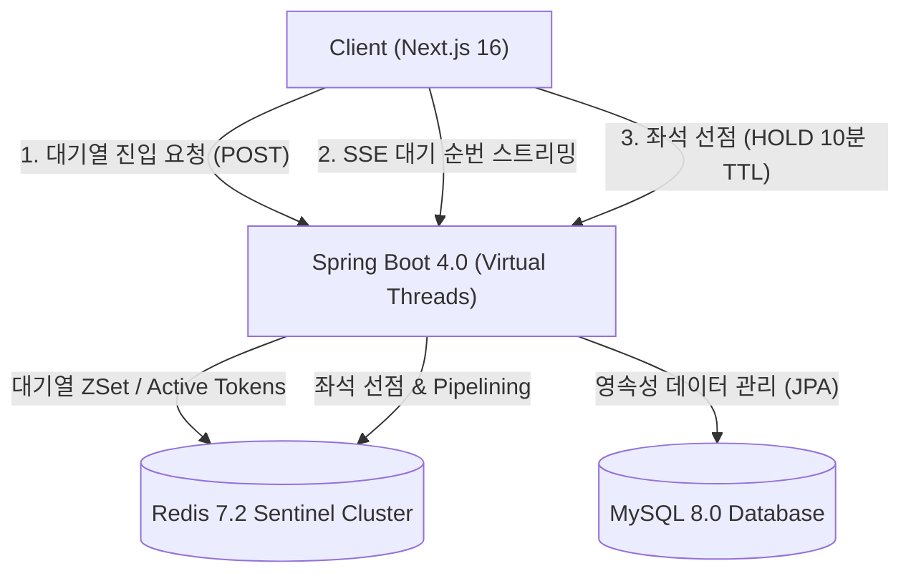

<div align="center">

# 🎫 티케팅고 (Ticketing Go)

**콘서트부터 페스티벌까지, 원하는 공연을 가장 빠르게 예매하세요.**

*대기열 순번 제어 · 실시간 SSE 좌석 동기화 · 인원수별 좌석 자동 배정 · 오리지널 3D 티켓 발급*

<br/>


</div>

---

## 목차

<div align="center">

[**소개**](#소개) &nbsp;•&nbsp; [**시스템 아키텍처**](#시스템-아키텍처) &nbsp;•&nbsp; [**주요 기능**](#주요-기능)

[**기술 스택**](#기술-스택) &nbsp;•&nbsp; [**시작하기**](#시작하기) &nbsp;•&nbsp; [**E2E 테스트**](#e2e-시스템-통합-테스트)

[**프로젝트 구조**](#프로젝트-구조) &nbsp;•&nbsp; [**트러블슈팅**](#트러블슈팅--faq) &nbsp;•&nbsp; [**Git 컨벤션**](#git-컨벤션)

</div>

---

## 소개

**티케팅고(Ticketing Go)**는 초고속 수천 명의 동시 접속자가 몰리는 대형 콘서트/페스티벌 티켓팅 환경을 완벽하게 처리하는 **대용량 트래픽 예매 플랫폼**입니다.

- **대기열 붕괴 방지**: Redis ZSet 기반 순번 처리와 **Server-Sent Events (SSE)** 스트리밍을 결합하여, DB 과부하 없이 동시 접속자를 안정적으로 제어합니다.
- **실시간 좌석 선점 동기화**: SSE 상태 스트림(`/seats/status`)을 통해 선점(HOLD, 10분 TTL), 판매완료(SOLD_OUT) 상태를 실시간으로 모든 유저에게 동기화합니다.
- **오리지널 티켓 3D 경험**: 결제 완료 시 한 번의 예매 단위로 묶인 티켓 카드에 앞면(포스터)·뒷면(상세정보) 3D 뒤집기 애니메이션 및 모바일 QR 코드 검증 기능을 제공합니다.

---

## 시스템 아키텍처



---

## 주요 기능

### 1. 공연 탐색 및 조건별 검색
- **정렬 및 필터**: 최신순, 마감임박순, 공연중 / 마감된 공연 필터링 지원
- **실시간 키워드 검색**: 공연 제목 및 키워드 기반 결과 카드 실시간 필터링

### 2. Redis ZSet + SSE 기반 실시간 대기열
- **순번 실시간 내비게이션**: 동시 접속자 수 초과 시 대기열 팝업이 발동되며, 나의 실시간 대기 순번이 SSE로 지속 갱신됩니다.
- **자동 승격 및 Active 토큰 발급**: 선두 인원이 퇴장하거나 결제 완료 시, 대기 중인 다음 유저가 자동으로 Active 상태로 승격되며 좌석 선택 화면으로 이동합니다.

### 3. 실시간 좌석선점 & 인접 좌석 자동 배정
- **인접 좌석 페어링**: 2인 이상 예매 선택 시 자동으로 옆자리를 감지하여 최적의 인접 좌석을 단번에 선택합니다.
- **실시간 SSE 동기화**: 다른 유저가 좌석을 클릭해 선점(`HOLD`)하면, 접속해 있는 모든 유저의 화면에서 해당 좌석이 실시간으로 비활성화됩니다.
- **Redis Pipelining 최적화**: 100+개 이상의 좌석 상태를 Redis 파이프라이닝으로 단 1회 RTT에 일괄 조회/선점합니다.

### 4. 예매 / 결제 및 안전한 좌석 해제
- **10분 TTL 선점 보장**: 결제 진행 중 유저 이탈이나 시간 초과 시 1초 주기 스케줄러가 선점된 좌석을 `AVAILABLE`로 자동 복구합니다.
- **중복 결제 방지**: 낙관적/비관적 락과 Redis 원자적 스크립트를 조합하여 한 좌석이 중복 결제되는 현상을 원천 방지합니다.

### 5. 오리지널 3D 티켓 & 모바일 QR 입장 검증
- **3D 인터랙션 티켓**: 카드 앞면(공연 포스터)과 뒷면(공연일시, 좌석번호, 예매자정보)을 클릭 시 3D 롤링 인터랙션으로 감상할 수 있습니다.
- **모바일 QR 검증 시스템**: `/verify/group/[groupToken]` 페이지를 통해 현장 스태프가 모바일로 QR 코드를 스캔해 티켓 세트를 즉시 검증할 수 있습니다.

---

## 기술 스택

| 구분 | 주요 기술 / 라이브러리 |
|---|---|
| **Frontend** | **Next.js 16 (App Router)**, **React 19**, **TypeScript 5.x**, **Tailwind CSS v4**, pnpm, `@microsoft/fetch-event-source` (SSE), SweetAlert2, Lucide React |
| **Backend** | **Kotlin 2.4.10 (100%)**, **Java 25**, **Spring Boot 4.0.7 (Virtual Threads)**, Gradle 9.5+, Spring Data JPA |
| **Database & Cache** | **MySQL 8.0**, **Spring Data Redis** (`StringRedisTemplate`, Pipelining, Lua Scripts), **Redis 7.2 Sentinel Cluster**, H2 In-Memory |
| **Security & Auth** | **OAuth2** (Kakao, Naver, Google), **JJWT 0.13.0** (Access/Refresh Token Rotation), Bucket4j Rate Limiting |
| **E2E Testing** | **`@playwright/test` 1.62+**, Page Object Model (POM) Architecture, Multi-webServer Orchestration |
| **Infrastructure** | **Terraform IaC**, **AWS** (EC2, VPC, Security Group, IAM, SSM Parameter Store), Docker & GitHub Actions |

---

## 시작하기

### 1. 저장소 클론
```bash
git clone https://github.com/prgrms-be-devcourse/NBE10-12-2-Team02.git
cd NBE10-12-2-Team02
```

### 2. 프론트엔드 환경 설정
`front/.env.local` 파일을 새로 만들고 아래 내용을 입력합니다.
```env
NEXT_PUBLIC_API_BASE_URL=http://localhost:8080
```

```bash
cd front
pnpm install
pnpm dev
```

### 3. 백엔드 환경 설정
`back/src/main/resources/application-secret.yaml`을 만들고 보안 키 항목을 채웁니다.
```yaml
spring:
  security:
    oauth2:
      client:
        registration:
          kakao:
            client-id: {카카오 클라이언트 ID}
            client-secret: {카카오 시크릿}
          naver:
            client-id: {네이버 클라이언트 ID}
            client-secret: {네이버 시크릿}
          google:
            client-id: {구글 클라이언트 ID}
            client-secret: {구글 시크릿}
custom:
  oauth:
    token:
      encryption-key: {AES-256 Base64 인코딩 32바이트 키}
```

```bash
cd back
./gradlew bootRun
```

---

## E2E 시스템 통합 테스트

최상위 `e2e/` 패키지에서 백엔드(`localhost:8080`)와 프론트엔드(`localhost:3000`)를 **자동으로 시동하여 8대 주요 시나리오 11개 핵심 케이스를 전수 검증**합니다.

```bash
cd e2e
pnpm install
npx playwright install chromium

# 전체 11개 통합 테스트 실행 (서버 자동 오케스트레이션)
pnpm test

# 대화형 UI 모드로 시각적 디버깅 실행
pnpm test:ui
```

### E2E 테스트 커버리지 명세

| 시나리오 | 스펙 파일 (`e2e/specs/`) | 주요 검증 내용 |
|:---:|---|---|
| **인증/회원** | `auth.spec.ts` | 로그인 폼, 에러 얼럿, 토큰 세션 저장 |
| **공연탐색** | `concert.spec.ts` | 공연 목록 정렬, 마감필터, 키워드 검색, 상세 회차 |
| **대기열** | `queue.spec.ts` | 다중 브라우저(3인) 동시 접속 정원(2인) 차단 및 순번 노출 |
| **실시간좌석** | `seat-booking.spec.ts` | SSE 연결(`/seats/status`), 좌석 클릭 선점 동기화 |
| **결제** | `payment.spec.ts` | 선점 금액 요약, 동의 체크, 예매 완료 처리 |
| **게시판** | `board-notification.spec.ts` | 관람후기/기대평 목록 및 작성 폼 렌더링 |
| **마이페이지** | `mypage.spec.ts` | 내 정보, 티켓 목록, 프로필 관리 렌더링 |
| **QR검증** | `ticket-verify.spec.ts` | 모바일 입장 QR 토큰 묶음 검증 렌더링 |

---

## 프로젝트 구조

```text
NBE10-12-2-Team02/
├── back/                   # Kotlin 2.4 + Spring Boot 4.0 백엔드
│   ├── src/main/kotlin/    # 도메인별 패키지 (concert, schedule, ticket, waiting, user)
│   └── src/test/kotlin/    # 단위 및 통합 테스트 코드
├── front/                  # Next.js 16 + React 19 프론트엔드
│   ├── src/app/            # App Router 기반 페이지 & 컴포넌트
│   └── src/lib/            # API 통신, 검증기, 유틸리티
├── e2e/                    # Playwright 통합 테스트 패키지
│   ├── pages/              # Page Object Models (페이지 추상화 클래스)
│   └── specs/              # 8대 시나리오 테스트 스펙
├── infra/                  # Terraform 기반 AWS 인프라 구축
│   ├── main.tf             # EC2, VPC, Security Group 정의
│   └── iam.tf              # AWS IAM 최소 권한 정책
└── .github/                # GitHub Workflows & Gemini 프롬프트 문서
    ├── workflows/          # CI, CD, E2E, Gemini 리뷰 액션
    └── prompts/            # Gemini 리뷰 전문 지침 문서
```

---

## 트러블슈팅 & F.A.Q

<details>
<summary><b>1. 백엔드 시동 시 Redis 연결 에러가 발생합니다.</b></summary>
<br/>
로컬 개발 환경에서는 Docker로 Redis 6379 포트를 띄우거나 <code>docker compose up</code>을 실행해 주세요. (CI 환경에서는 <code>SPRING_PROFILES_ACTIVE=test</code> 프로파일을 사용합니다.)
</details>

<details>
<summary><b>2. 프론트엔드에서 로고 이미지가 개발 모드 경고를 출력하나요?</b></summary>
<br/>
벡터 SVG 그래픽(로고 등)은 Next.js <code>&lt;Image&gt;</code> 대신 표준 <code>&lt;img&gt;</code> 태그를 사용하여 불필요한 서버 이미지 최적화 연산 및 개발모드 비율 경고를 완벽히 제거했습니다.
</details>

<details>
<summary><b>3. Docker 빌드 중 테스트가 진행되나요?</b></summary>
<br/>
네, <code>back/Dockerfile</code> 내 <code>RUN SPRING_PROFILES_ACTIVE=test ./gradlew bootJar --no-daemon</code>을 통해 Docker 이미지를 생성하는 시점에도 백엔드 전체 테스트가 100% 실행되어 안전성을 보장합니다.
</details>

---

## Git 컨벤션

- **브랜치 규칙**: `feat/{이슈번호}`, `fix/{이슈번호}`, `refactor/{이슈번호}`, `test/{이슈번호}`
- **커밋 메시지**: `feat: 내용 (#이슈번호)`, `fix: 내용 (#이슈번호)`, `docs: 내용 (#이슈번호)`, `test: 내용 (#이슈번호)`
- **Pull Request**: 1인 이상 리뷰 승인 후 Squash Merge, 본문에 `Closes #이슈번호` 명시

---

<div align="center">

Made by **Team 02**

</div>
